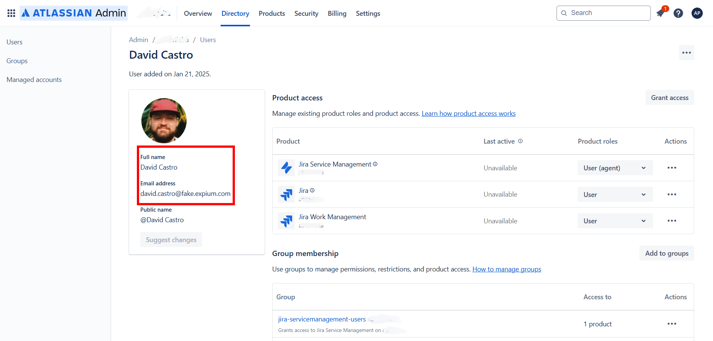
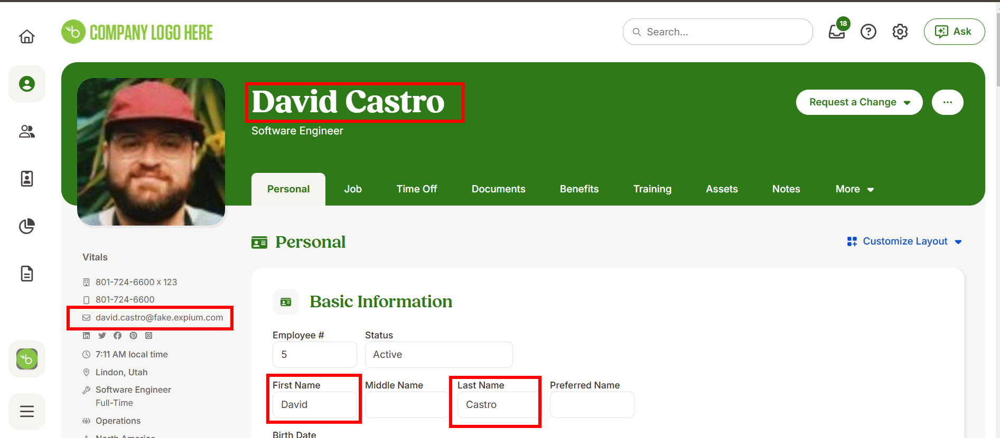

# BambooHR
You will need a BambooHR account. If you don't have one you can request for a trial at <a href="https://www.bamboohr.com/signup/" target="_blank">BambooHR Trial</a>.

You must have the following created inside Bamboo to work with TimeWarden:

* A group of users which will have the same email and display name (name+surname) from the team of users created on the Jira project and a hire date before the sprint project start dates.

* An API key which you will use for the connectors

