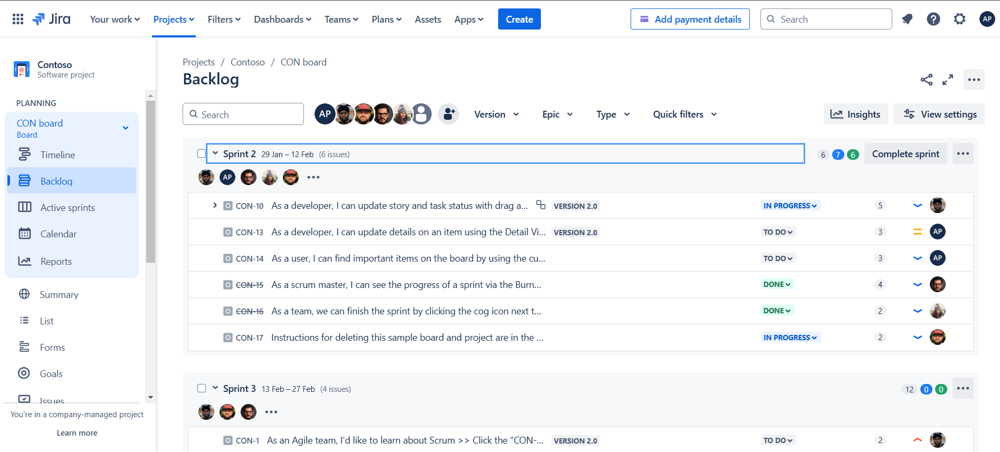
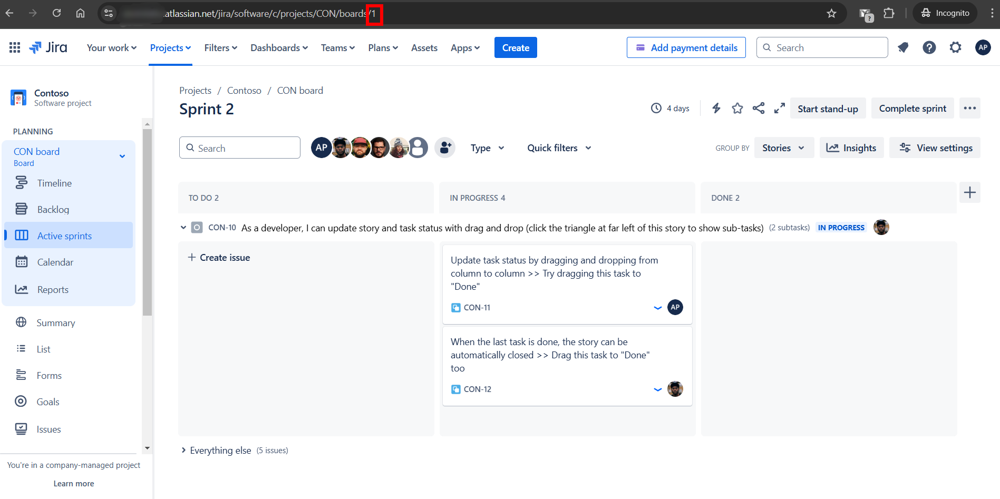
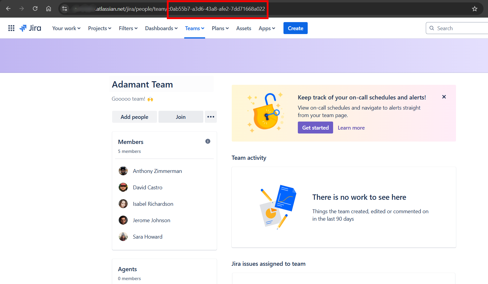
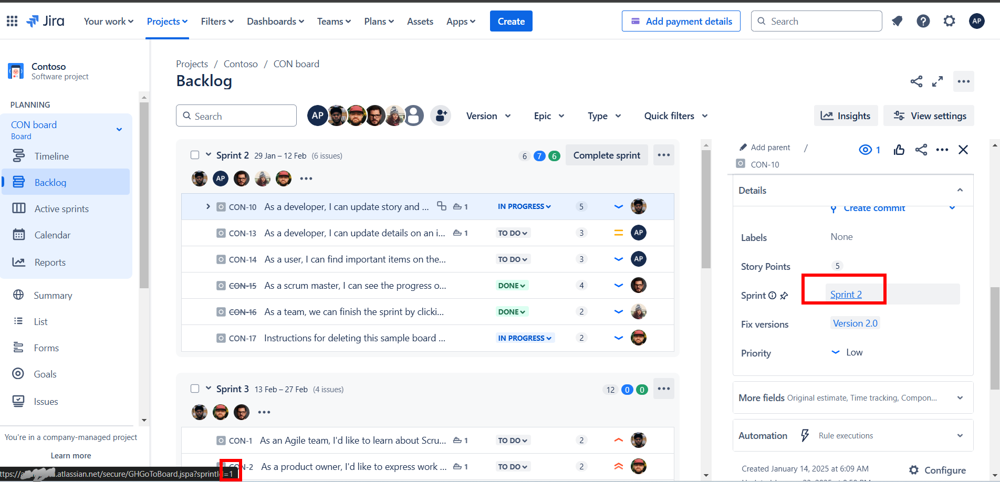
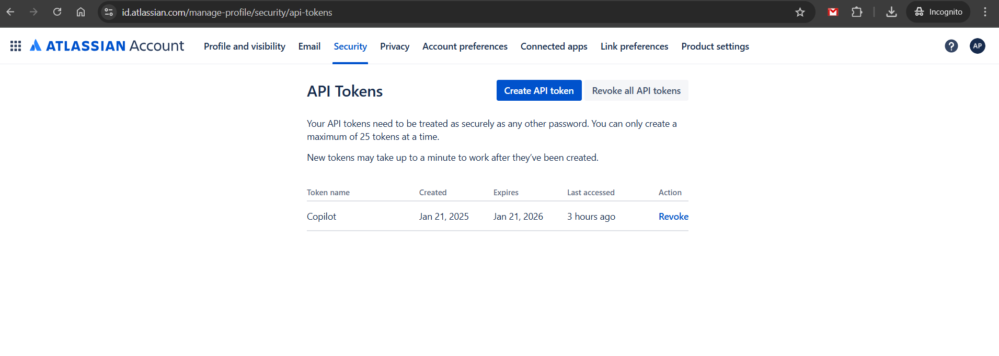

# JIRA
You will need an Atlassian Jira account. If you don't have one you can request for a trial at <a href="https://www.atlassian.com/try/cloud/signup?bundle=jira-software&edition=free&skipBundles=true" target="_blank">Jira Trial</a>.

You must have the following created inside JIRA to work with TimeWarden:

* A team of users
* A SCRUM based project
* At least 2 sprints: a current one and a future one.
* Setup story points for stories on the sprints.

If you are starting from scratch and don't wnat to create all data manually you can use the following tool <a href="http://jumble.expium.com/" target="_blank">Jumble for Jira</a> which will create test data for users, projects and issues.

Some id's must be recovered from Jira to setup the environment variables:

* Organization Id: Can be recovered from the browser url:

* Board Id: Can be recovered from the browser url:

* Team Id: Can be recovered from the browser url:

* Sprint Id: Can be recovered when hovering on the current story sprint on the left side will appear the url of that sprint:

* JIRA API key: You can create it through the following link:  https://id.atlassian.com/manage-profile/security/api-tokens. 

