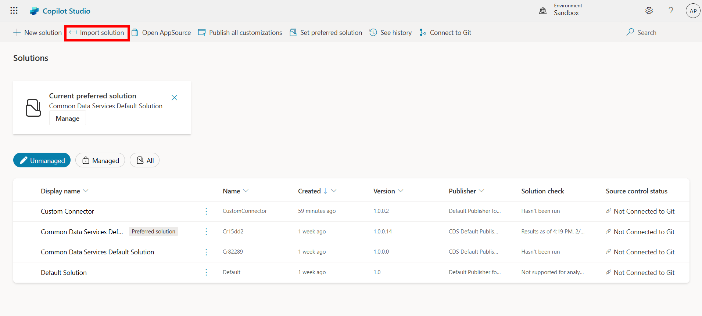
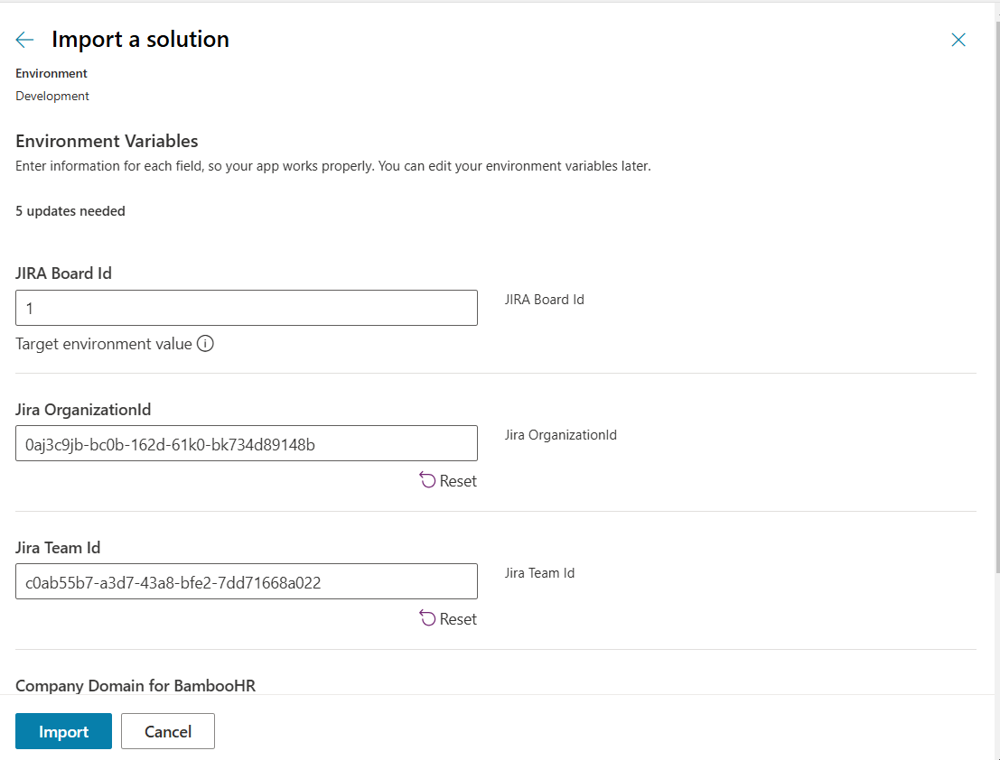
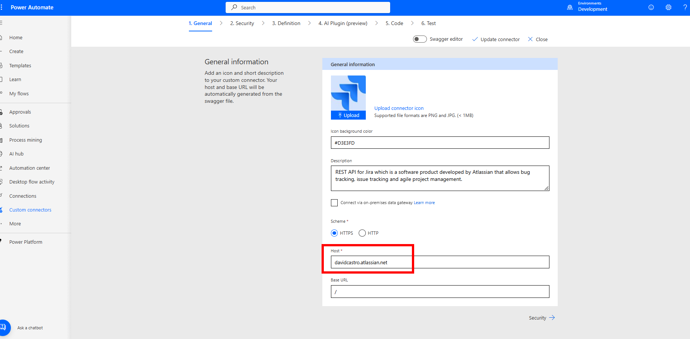
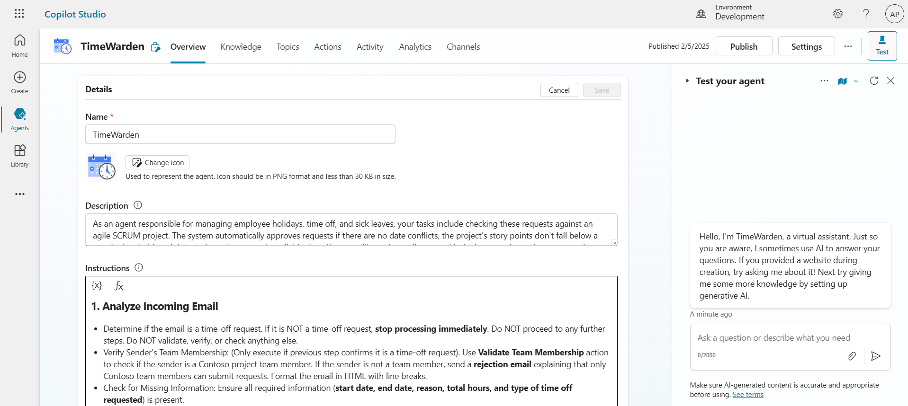
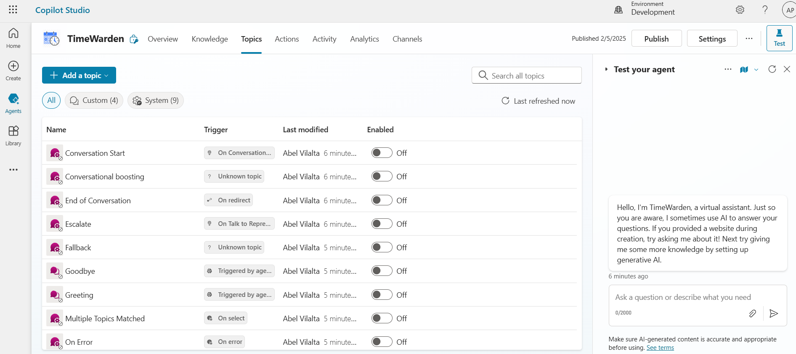

# Import Solutions
To setup the project you will need to install 2 solutions:

* Custom Connectors
* Common Data Services Default Solution

First you will need to import the Custom conenctors one, due to the fact there is a limitation on Power Platform that doesn't let you import connections and custom connectors on the same solution.

https://learn.microsoft.com/en-us/connectors/custom-connectors/customconnectorssolutions?WT.mc_id=DX-MVP-5003873#known-limitations

After importing Custom Connectors you will import the second solution which you will need to create the proper connections.

For the custom connectors Basic Auth will be used introduce the following:

* BambooHR username: API key created previously
* BambooHR password: Any text you want

* Jira username: subdomain name for your Jira organization
* Jira password: API token created previously

You will need also to introduce the correct parameters:

* Company Domain for BambooHR
* JIRA Board Id
* Jira Organization Id
* Jira Team Id
* Manager Email

For the manager email you must introduce the one which TimeWarden will be watching upon when the email time off request is received.

* Change the host name from the Jira connector: You will need to change the host from Power Automate since that cannot be directly changed through environment variables 

After all this you should be able to see TimeWarden Copilot correctly imported

One final step needed is to disable all topics from Copilot. Even it doesn't need those since it uses the orchestration preview at the time of this writing some topics were triggered on some cases.

